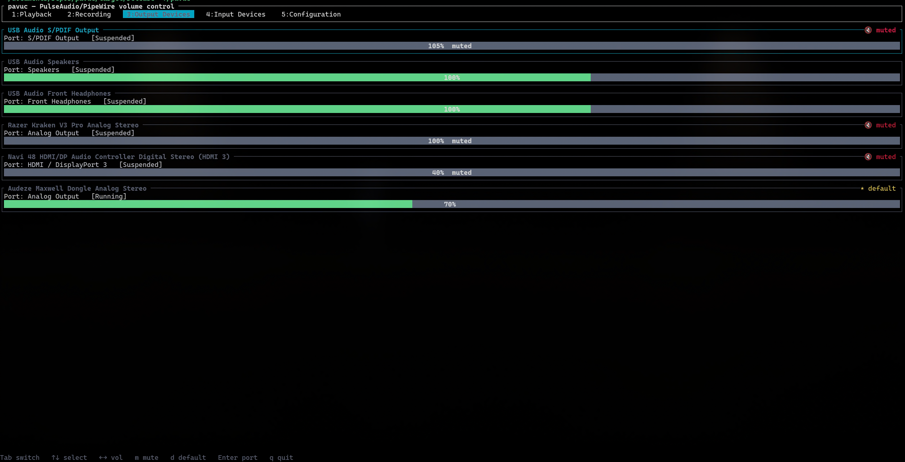

# pavuc

A **[pavucontrol](https://freedesktop.org/software/pulseaudio/pavucontrol/) analogue** TUI built with [ratatui](https://ratatui.rs).

## Features

A faithful, keyboard-driven port of pavucontrol's functionality:

- **Playback** — per-application streams with volume bars, mute, routing to a
  different output (`Enter`), and the ability to kill a stream (`x`).
- **Recording** — per-application capture streams with volume, mute and routing
  to a different input.
- **Output Devices** — sinks with volume, mute, set-as-default (`d`) and port
  selection (`Enter`).
- **Input Devices** — sources with volume, mute, set-as-default and port
  selection.
- **Configuration** — sound cards with profile selection (`Enter`).
- Live updates: the view reflects changes made by other apps in real time via
  PulseAudio's subscription events.

## Requirements

- A running **PulseAudio** server **or PipeWire with `pipewire-pulse`**.
- `libpulse` at build time.

## Keybindings

| Key                          | Action                                              |
| ---------------------------- | --------------------------------------------------- |
| `1`–`5`, `Tab` / `Shift+Tab` | Switch tabs                                         |
| `↑`/`↓` or `k`/`j`           | Move selection                                      |
| `←`/`→` or `h`/`l`           | Volume −/+ 5%                                       |
| `<`/`>` or `,`/`.`           | Volume −/+ 1% (fine)                                |
| `m`                          | Toggle mute                                         |
| `d`                          | Set device as default (Output/Input tabs)           |
| `Enter`                      | Route stream / select port / select profile (popup) |
| `x`                          | Kill the selected stream (Playback/Recording)       |
| `q` / `Esc`                  | Quit (or close an open popup)                       |
